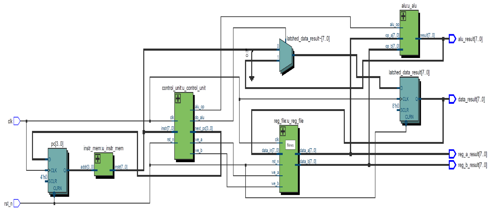
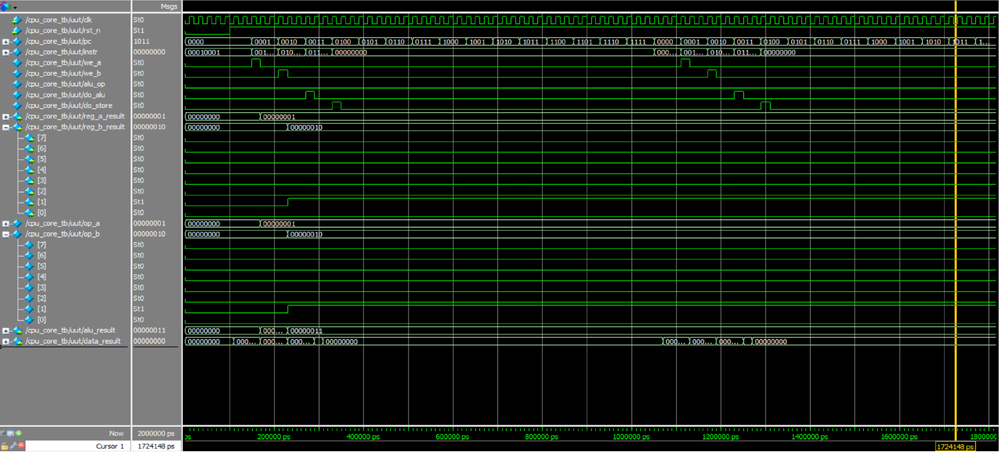

# mini_cpu_project

本專案是一個簡易 8-bit CPU 設計，包含基本的 Fetch、Decode、Execute 流程。  
設計平台：**Quartus Prime** + **ModelSim**

## 檔案說明

- `cpu_core.v`：CPU 核心頂層模組
- `control_unit.v`：控制單元 (Control Unit)
- `reg_file.v`：暫存器檔 (Register File)
- `alu.v`：算術邏輯單元 (ALU)
- `instr_mem.v`：指令記憶體 (Instruction Memory)
- `cpu_core_tb.v`：CPU 測試平台 (Testbench)
- `RTL_cpu_core.png`：RTL 結構圖
- `wave_cpu_core_tb.png`：模擬波形圖

## 功能特性

- 指令集支援：
  - `LOAD` 載入暫存器
  - `ADD` 加法運算
  - `SUB` 減法運算
  - `STORE` 儲存結果
- 基本狀態機：
  - Fetch → Decode → Execute
- 資料路徑同步設計（時脈觸發）

## RTL 結構圖

## 模擬波形圖

## 開發工具版本

- Quartus Prime Lite Edition 18.0
- ModelSim - Intel FPGA Edition 10.5b
